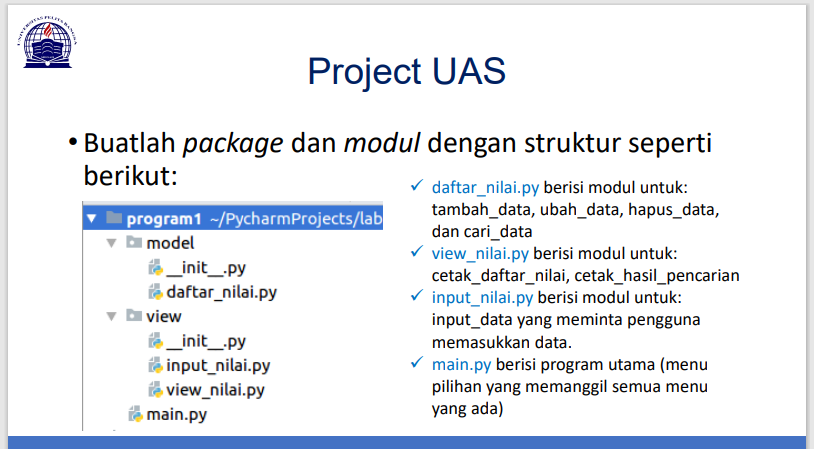
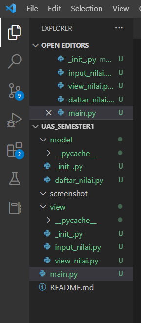
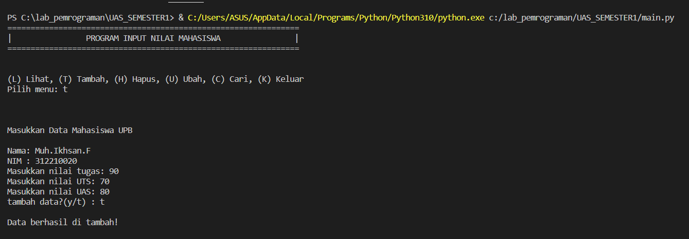
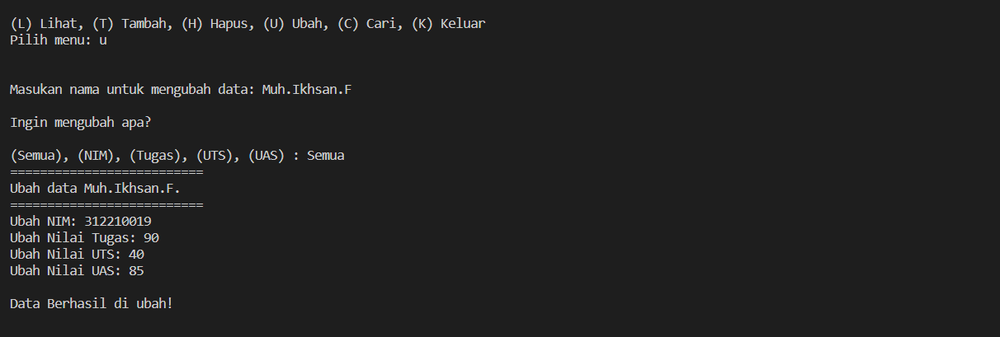
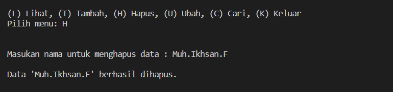
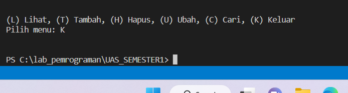

# Project UAS { Semester 1 }  

|**Nama**|**NIM**|**Kelas**|**Matkul**|
|----|---|-----|------|
|Muhammad Ikhsan Fakhrudin|312210019|TI.22.A2|Pemrograman|

# SOAL UJIAN



# Struktur Package & Module



# Kode Program

- Didalam folder / package **Model** terdapat 1 file dengan nama daftar nilai. Dan didalam file tersebut telah terdapat beberapa function yang dibuat untuk menjalankan program tersebut.
- Berikut adalah isi dari file `daftar_nilai.py`

```
from view.input_nilai import *

data = {}

# Menambahkan data
def tambah_data():
    global data
    ulangi = 'y'
    while ulangi =='y':
        nama = input_nama()
        nim = input_nim()
        nilai_tugas = input_ntugas()
        nilai_uts = input_nuts()
        nilai_uas = input_nuas()
        nilai_akhir = nakhir()
        data[nama] = [nama, nim, nilai_tugas, nilai_uts, nilai_uas, nilai_akhir]
        ulangi = (input('tambah data?(y/t) : '))

        if ulangi == 't':
            print('\nData berhasil di tambah!')
            return data

# Mengubah data
def ubah_data():
    nama = input("Masukan nama untuk mengubah data: ")
    if nama in data.keys():
        print("\nIngin mengubah apa?")
        print()
        sub_data = input("(Semua), (NIM), (Tugas), (UTS), (UAS) : ")
        if sub_data.lower() == "semua":
            print("==========================")
            print("Ubah data {}.".format(nama))
            print("==========================")
            data[nama][1] = input("Ubah NIM: ")
            data[nama][2] = int(input("Ubah Nilai Tugas: "))
            data[nama][3] = int(input("Ubah Nilai UTS: "))
            data[nama][4] = int(input("Ubah Nilai UAS: "))
            data[nama][5] = data[nama][2] *30/100 + data[nama][3]*35/100 + data[nama][4] *35/100
            print("\nData Berhasil di ubah!")

        elif sub_data.lower() == "nim":
            data[nama][1] = input("\nNIM: ")
            print('\nData berhasil di ubah!')
        elif sub_data.lower() == "tugas":
            data[nama][2] = int(input("\nNilai Tugas: "))
            data[nama][5] = data[nama][2] *30/100 + data[nama][3]*35/100 + data[nama][4] *35/100
            print('\nData berhasil di ubah!')
        elif sub_data.lower() == "uts":
            data[nama][3] = int(input("\nNilai UTS: "))
            data[nama][5] = data[nama][2] *30/100 + data[nama][3]*35/100 + data[nama][4] *35/100
            print('\nData berhasil di ubah!')
        elif sub_data.lower() == "uas":
            data[nama][4] = int(input("\nNilai UAS: "))
            data[nama][5] = data[nama][2] *30/100 + data[nama][3]*35/100 + data[nama][4] *35/100
            print('\nData berhasil di ubah!')
        else:
            print("\nMenu tidak ditemukan.")

    else:
        print("'{}' Tidak ditemukan.".format(nama))

# Menghapus data
def hapus_data():
    nama = input("Masukan nama untuk menghapus data : ")
    if nama in data.keys():
        del data[nama]
        print("\nData '{}' berhasil dihapus.".format(nama))
    else:
        print("'{}' Tidak ditemukan.".format(nama))

# Mencari data
def cari_data():
    print("Mencari data: ")
    print("=================================================")
    nama = input("Masukan nama untuk mencari data: ")
    print('\nHasil')
    print("==============================================================")
    print("|      Nama      |    NIM    | Tugas |  UTS  |  UAS  | Akhir |")
    print("==============================================================")
    if nama in data.keys():
        print("| {0:14} | {1:9} | {2:5} | {3:5} | {4:5} | {5:5} |"
            .format(nama, data[nama][1], data[nama][2], data[nama][3], data[nama][4], data[nama][5]))
        print('-----------------------------------------------------------------')
    else:
        print("'{}' Tidak ditemukan.".format(nama))
```

- Disisi lain saya membuat folder / package **view** yang berisi file input_nilai.py dan view_nilai.py

- Berikut adalah isi dari file `input_nilai.py :`

```
# Menginput data
def input_nama():
    print("\nMasukkan Data Mahasiswa UPB")
    global nama
    nama = input("\nNama: ")
    return nama


def input_nim():
    global nim
    nim = input("NIM : ")
    return nim


def input_ntugas():
    global nilai_tugas
    nilai_tugas = int(input("Masukkan nilai tugas: "))
    return nilai_tugas


def input_nuts():
    global nilai_uts
    nilai_uts = int(input("Masukkan nilai UTS: "))
    return nilai_uts


def input_nuas():
    global nilai_uas
    nilai_uas = int(input("Masukkan nilai UAS: "))
    return nilai_uas


# Nilai akhir
def nakhir():
    global nilai_akhir
    nilai_akhir = (nilai_tugas)*30/100 + (nilai_uts)*35/100 + (nilai_uas)*35/100
    return nilai_akhir
```

- Berikut adalah isi dari file `view_nilai.py :`

```
# Menampilkan data
from model.daftar_nilai import data

def lihat_data():
    print("Daftar Nilai:")
    print("===================================================================")
    print("| No |      Nama      |    NIM    | Tugas |  UTS  |  UAS  | Akhir |")
    print("===================================================================")
    if data.keys():
        no = 1
        for tabel in data.values():
            print("| {0:2} | {1:14} | {2:9} | {3:5} | {4:5} | {5:5} | {6:5} |".format
                (no, tabel[0], tabel[1], tabel[2], tabel[3], tabel[4], tabel[5]))
            print('-------------------------------------------------------------------')
            no += 1
    else:
        print("=========================TIDAK ADA DATA============================")
        print("===================================================================")
```

- Setelah membuat banyak folder / package dan function, saya membuat file index atau file utamanya. Yang saya beri nama `main.py`. Berikut isi dari file tersebut :

```
from model.daftar_nilai import *
from view.view_nilai import *

#Mulai
print("===============================================================")
print("|                PROGRAM INPUT NILAI MAHASISWA                |")
print("===============================================================")

while True:
    print("\n")
    menu = input("(L) Lihat, (T) Tambah, (H) Hapus, (U) Ubah, (C) Cari, (K) Keluar\nPilih menu: ")
    print("\n")

    # menu
    if menu.lower() == 't':
        tambah_data()

    elif menu.lower() == 'c':
        cari_data()

    elif menu.lower() == 'l':
        lihat_data()

    elif menu.lower() == 'u':
        ubah_data()

    elif menu.lower() == 'h':
        hapus_data()

    # Keluar
    elif menu.lower() == 'k':
        break

    else:
        print("Ada yang salah, Silahkan cek kembali.")
```

# Output

**Tambah Data**



**Ubah Data**



**Cari Data**


**Hapus Data**



**Keluar**



**Sekian Project UAS Semester 1 dari saya.**

**Jika Masih Ada Yang Salah Saya Mohon Maaf.**

**Wassalamualaikum wr.wb.**

**Sampai Ketemu lagi di Semester Berikutnya.**